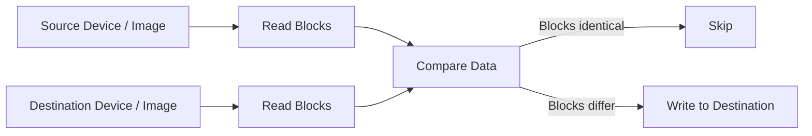

# diffdup

Efficient incremental duplication for raw devices and disk images


> `diffdup` performs **incremental duplication of raw devices and disk images**, copying only blocks that differ — similar to `rsync`, but for block storage.

**Key capabilities**

- Incremental duplication of **raw block devices**
- Works with **encrypted containers without decrypting them**
- Avoids rewriting identical data
- Optimized for **large sequential datasets**

Imagine you wanted to mirror an encrypted thumb drive (or other raw data) to another device, but you didn't want to duplicate the entirety of the data every time you did so. Normally you could use tools like `rsync`, `rclone`, or similar utilities — but they operate at the filesystem level, which would require decrypting and mounting the volume first. Or maybe the filesystem is simply unable to be mounted.

`diffdup` is a Linux utility for **differential duplication of block devices or files**, designed to work with devices by treating them as **opaque data**. It reads data from a source device, compares it with a destination device, and **only writes blocks that differ**.

The advantage is minimizing unnecessary writes when cloning disks or large files. This can significantly reduce wear on SSDs and improve performance when most of the data is already identical.

This tool is designed for **large sequential datasets** such as:

* disk images
* block devices
* backup volumes
* encrypted containers
* large filesystems

It uses vectored I/O and optional manual readahead to achieve high throughput while keeping memory usage predictable.

---

## Contents

- [Quick Example](#quick-example)
- [How It Works](#how-it-works)
- [Features](#features)
- [Project Status](#project-status)
- [Why This Exists](#why-this-exists)
- [Comparison](#comparison)
- [Requirements](#requirements)
- [Building](#building)
- [Usage](#usage)
- [Performance Tuning](#performance-tuning)
- [Signals](#signals)
- [Design Notes](#design-notes)

---

## Quick Example

A common use case is maintaining a backup of an encrypted container or raw disk where the filesystem cannot be accessed directly.

### Initial full copy

First create the initial duplicate using `dd`:

```bash
sudo dd if=/dev/sda of=/dev/sdb bs=16M status=progress
```

This performs a full device copy. Both disks now contain identical encrypted data.

### Later: small change to the source

Suppose the encrypted volume on `/dev/sda` is later opened and modified.  
Only a small portion of the underlying encrypted data actually changes.

Using `dd` again would rewrite the entire device:

```bash
sudo dd if=/dev/sda of=/dev/sdb bs=16M status=progress
```

Even though most of the data is already identical.

### Updating the copy with `diffdup`

Instead, `diffdup` compares the devices and writes **only the blocks that differ**:

```bash
sudo diffdup -s /dev/sda -d /dev/sdb
```

This updates the backup device without rewriting unchanged data.

### Incremental updates

Each time the encrypted container changes, the backup can be updated incrementally:

```bash
sudo diffdup -s /dev/sda -d /dev/sdb
```

Only modified blocks are written, making repeated synchronization fast and minimizing unnecessary writes.


### Incremental Synchronization

```
Initial state after cloning with dd

   Source (/dev/sda)          Destination (/dev/sdb)

   [A][B][C][D][E][F]   -->   [A][B][C][D][E][F]


After modifying the encrypted container on the source

   Source (/dev/sda)          Destination (/dev/sdb)

   [A][B][X][D][E][Y]         [A][B][C][D][E][F]
           ^       ^
        changed  changed


Running diffdup

   Compare blocks sequentially
   ├─ A == A → skip
   ├─ B == B → skip
   ├─ X != C → write
   ├─ D == D → skip
   ├─ E == E → skip
   └─ Y != F → write


Final result

   Source (/dev/sda)          Destination (/dev/sdb)

   [A][B][X][D][E][Y]   -->   [A][B][X][D][E][Y]
```

---

## How It Works



---

## Features

* **Differential duplication** – writes only blocks that differ
* **Vectored I/O (`readv` / `writev`)** for high throughput
* **Adaptive I/O tuning** to determine optimal chunk and buffer sizes
* **Optional manual readahead**
* Works with **regular files and block devices**
* **Verification modes** for integrity checking
* Designed for **large datasets and long-running operations**
* Clean **POSIX/Linux implementation** with no external dependencies
* Runtime progress reporting via `SIGUSR1`

---

## Project Status

`diffdup` is currently functional and suitable for real-world use with disk images and block devices.

Some interface details and option behaviors may still evolve as the tool is refined. Feedback and testing are welcome.

---

## Why This Exists

Tools like `dd` can clone disks, but they always copy the entire device even when most of the data is already identical.

Filesystem tools like `rsync` avoid rewriting identical data, but they operate on files and therefore require mounting the filesystem first.

In many situations that is not possible or desirable, such as when working with:

* encrypted containers
* damaged filesystems
* unknown or unsupported filesystems
* forensic disk images
* raw backup volumes

`diffdup` fills this gap by providing **rsync-like incremental behavior at the block-device level**, allowing efficient duplication of raw storage **without requiring filesystem access**.

---

## Comparison

`diffdup` combines the raw-device capability of `dd` with the incremental behavior of `rsync`.

| Tool | Raw Device Support | Incremental / Avoids Rewriting Identical Data | Filesystem Independence | Typical Use Case |
|-----|-----|-----|-----|-----|
| `dd` | ✓ | ✗ | ✓ | Full disk cloning |
| `ddrescue` | ✓ | ✗ | ✓ | Recover data from failing drives |
| `rsync` | ✗ | ✓ | ✗ | File-level synchronization |
| `partclone` | Partition-level | Skips unused blocks | ✗ | Efficient filesystem imaging |
| `fsarchiver` | Partition-level | Skips unused blocks | ✗ | Compressed filesystem backups |
| **`diffdup`** | **✓** | **✓** | **✓** | Incremental duplication of raw devices |

---

## Requirements

* Linux
* GCC or Clang
* Kernel support for:

  * `readv`
  * `readahead`
  * `posix_fadvise`
  * `BLKGETSIZE64`

---

## Building

Clone the repository and build using autotools:

```bash
autoreconf -i
./configure
make
```

---

## Usage

Basic syntax:

```bash
diffdup -s <source> -d <destination> [options]
```

### Basic duplication

Clone one disk to another:

```bash
sudo diffdup -s /dev/sda -d /dev/sdb
```

Clone a disk to a disk image:

```bash
sudo diffdup -s /dev/sda -d backup.img
```

### Progress reporting

```bash
diffdup -p -s source.img -d backup.img
```

### Automatic parameter tuning

```bash
diffdup --tune-parameters -s /dev/sda -d backup.img
```

### Verify integrity without writing

```bash
diffdup --verify-integrity -s /dev/sda -d backup.img
```

### Verify after duplication

```bash
diffdup --verify-integrity-after -s /dev/sda -d backup.img
```

### Verify writes during duplication

```bash
diffdup --verify-writes -s source.img -d /dev/sdb
```

### Manual performance configuration

```bash
diffdup -n 32 -b 4M -s source.img -d backup.img
```

### Toggle manual readahead

```bash
diffdup -r on -s source.img -d backup.img
```

Disable:

```bash
diffdup -r off -s source.img -d backup.img
```

---

## Performance Tuning

`diffdup` includes an **automatic I/O tuning stage** that benchmarks several configurations to determine optimal values for:

* chunk size
* number of I/O vectors
* readahead behavior

This allows the program to adapt to the characteristics of the underlying storage hardware.

Typical throughput can reach **hundreds of MB/s** depending on the device and system configuration.

---

## Signals

`diffdup` supports runtime signals during execution.

| Signal | Behavior |
|------|------|
| `SIGUSR1` | Print progress information |
| `SIGINT` | Graceful interruption |

Example:

```bash
kill -USR1 <pid>
```

---

## Design Notes

The program uses:

* vectored I/O (`preadv`)
* page-aligned buffers (`posix_memalign`)
* sequential read optimization (`readahead`)
* runtime throughput benchmarking

The design aims to maintain **consistent sequential throughput** while minimizing unnecessary writes.
